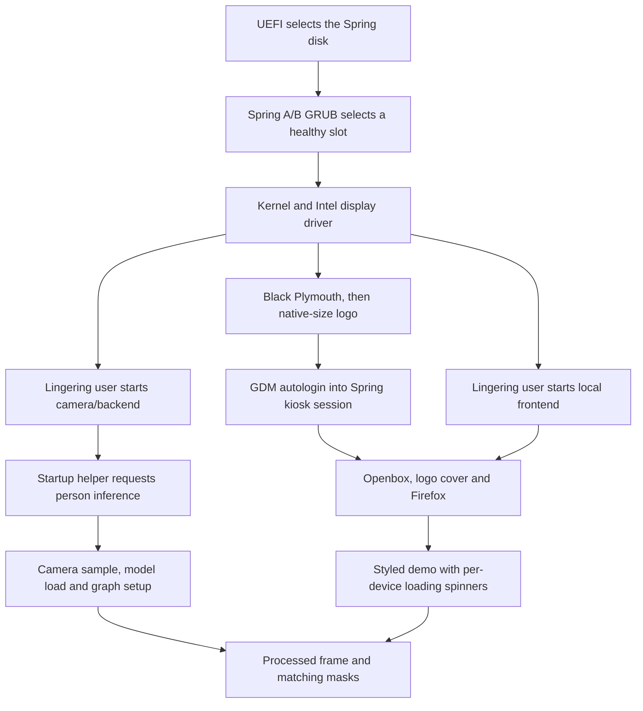

# Automatic demo startup on Spring Edge Turret

For fresh installation, exact runtime/model pins and private recovery archives,
see [Reproduce both devices](reproduce.md) and the [new B580 / Prague guide](new-b580.md).

Deployment: `spring-edge-turret` (Arc, `100.68.74.32`) and `agxthor-5`
(`100.88.90.48`). These are separate from the older direct-Ethernet deployment
on `spring-edge-2-1` and `agxthor-4`.

The Arc hosts the combined page at `http://127.0.0.1:8081/`. Its Arc panel
connects to its own backend on port 8080; its Thor panel connects **only over
the direct Ethernet cable** to `http://192.168.249.2:8080`. The frontend binds
source `192.168.249.1` on Arc `enp7s0`; it does not fall back to Wi-Fi/Tailscale.

## Direct cable configuration

Both hosts have a persistent, autoconnecting NetworkManager profile named
`turret-direct-ethernet`, with priority 999 and these verified NIC bindings:

| Host | Interface | MAC | Address |
|---|---|---|---|
| spring-edge-turret | enp7s0 | 9c:6b:00:dd:04:2e | 192.168.249.1/30 |
| agxthor-5 | enP2p1s0 | 44:49:c0:3c:fc:5c | 192.168.249.2/30 |

The link negotiates 1 Gbps. It supplies no gateway or DNS, has
`ipv4.never-default=yes`, and disables IPv6 on this dedicated link. Existing
Internet/management networking is unchanged. Do not reuse interface names or
MACs blindly on a replacement board; verify them first.

The frontend's `--thor-interface enp7s0 --thor-local-address 192.168.249.1`
options require the carrier/address and bind every Thor connection to the wired
source. Dedicated `inet turret_direct_link` firewall tables on both hosts also
block the peer's private address through any other interface. Rules are retained
when the link drops, and a NetworkManager pre-up dispatcher reinstalls them at
activation/boot. Only this dedicated table is managed; existing firewall tables
are unchanged. Installed files:

- `/etc/spring-turret-direct-link.nft`
- `/etc/NetworkManager/dispatcher.d/pre-up.d/90-turret-direct-link`

Templates are in `deploy/direct-ethernet/`; `arc.nft` targets the current Arc's
`enp7s0`, not the older `spring-edge-2-1` machine's `enp8s0`.

2026-09-08 verification: matching peer MACs, direct routes in both directions,
0.34 ms mean ping, real HTTP/frame packets on `enp7s0`, and frontend TCP sockets
only from `192.168.249.1` to `192.168.249.2:8080`. The preceding deployment used
the tailnet URL over Wi-Fi and showed a roughly 1.8 MB Thor send queue. Switching
the frontend cleared that queue without restarting either inference backend or
changing the active model, prompts, calibration or motor state.

## Boot sequence

- Arc's existing user backend `spring-turret-demo.service` is enabled.
  `loginctl enable-linger spring` lets it start at boot without a desktop login.
- Arc's user `spring-turret-frontend.service` is enabled for `default.target`.
  It runs an isolated, checksum-verified Node 22.23.2 runtime under
  `/home/spring/.local/share/spring-turret-frontend`, not system Node/Python.
- GDM automatically logs in as `spring` to the **Spring Turret Demo** X11
  session, selected through AccountsService and `/etc/gdm3/custom.conf`.
  Openbox manages only the kiosk windows; no GNOME desktop, dock, overview, or
  generic desktop autostarts run in this session. The root window is black.
- `kiosk-session.sh` imports the actual display/authentication environment and
  starts `spring-turret-kiosk.service`. The launcher displays the same native-size
  Spring logo as Plymouth, opens Firefox with its dedicated profile, and keeps
  the logo above the browser until the local page has painted both styled panels.
  The per-launch `/kiosk-ready/<token>` handshake stays within the frontend;
  it never contacts either inference backend or sends motor commands.
- Firefox uses X11 (`MOZ_ENABLE_WAYLAND=0`, `GDK_BACKEND=x11`,
  `DISABLE_WAYLAND=1`). This also avoids the installed Firefox's invisible
  Wayland kiosk window issue. The dedicated profile at
  `~/snap/firefox/common/spring-turret-kiosk-profile` skips onboarding and crash
  restoration. The browser restarts if it exits; stopping its service is explicit.
- Thor's existing system `spring-turret-demo.service`, Docker and its snap
  Tailscale service are enabled. No Thor model/container/runtime is replaced.
- Each host runs `spring-turret-inference-startup.service` once after its backend
  starts. It supplies `person` only when prompts are empty, so inference starts
  without a browser action. It preserves any already-selected prompts and never
  changes the model, target, or motor state. Readiness GETs can retry; the prompt
  POST is sent once and is never retried after an ambiguous failure.

The page does not wait for model compilation: each panel reconnects to its own
backend as it becomes available. Before the first completed image/mask pair,
Arc shows a circular spinner with **Spring is Coming** and Thor shows one with
**Thor is Loading**. Placeholder alt text, FPS placeholders, and routine model
preparation/connection messages are hidden. The loader disappears only after
painting a complete pair. Existing images remain visible during later model
changes and reconnects. Explicit command failures and operational errors remain
available after startup. Startup and viewer reconnects do not send
motor commands. Models and prompts use the backend's configured startup values;
servo zeros, geometry and angle limits are unchanged. The dedicated Firefox
profile skips welcome and pre-onboarding screens so first-run setup cannot
block the page. Motors remain unarmed
until Start is pressed. Closing the viewer does not stop an already armed motor.

Templates live in `deploy/startup/`. The kiosk starts from the dedicated GDM
session, after its display is available; the lingering user's boot target still
starts only the backend and frontend. The old GNOME `.desktop` autostart remains
as a fallback if an operator explicitly selects the Ubuntu session.

## Boot installation checklist

Use this with the [new-box guide](new-b580.md) and the private archive. The
quiet-boot installer changes the OS boot/session files; it is **not** a complete
runtime, frontend or model installer. All three layers below must be in place.



### 1. OS, firmware and display

- The target needs the matching Spring Edge foundation, B580 driver, graphical
  target, GDM/Xorg, Python GI with GTK3/GDK3, Openbox, X11 utilities, Plymouth,
  GRUB and desktop-file tools. Verify `systemctl get-default` is
  `graphical.target` and that `display-manager.service` resolves to GDM. GDM's
  `static` unit state by itself is not a failure; its display-manager alias and
  actual startup matter.
- Keep the target's UEFI disk entry, partition labels and A/B health state.
  Inspect `sudo efibootmgr -v` and `/boot/efi/EFI/spring/grub.cfg`; the Spring
  EFI script governs this menu, independently of `/etc/default/grub`. The
  installer sets its timeout to zero while preserving slot selection. Do not
  copy another machine's EFI `grubenv`, disk identifiers or initramfs.
- The active kernel command line needs `quiet splash`, plus
  `loglevel=3 systemd.show_status=false vt.global_cursor_default=0` for the
  quiet profile. The native-logo service is conditional on `splash`.
- The Spring Plymouth theme needs **all three** files under
  `/usr/share/plymouth/themes/spring-silicon/`: `spring-silicon.plymouth`,
  `spring-silicon.script`, and `spring-silicon-plymouth.png`. The installer
  supplies the script; the descriptor and actual logo asset come from the base
  OS/private archive. Keep the selected theme and rebuild the **target's** active
  initramfs, as the installer does.
- `show-native-logo.py` waits up to 15 seconds for an `xedrmfb` framebuffer at
  least 1920×1080; its unit has a 20-second timeout. A smaller or absent monitor
  can leave Plymouth black until the kiosk cover takes over. The wait is bounded
  and cannot promise a visible early logo on every monitor. Check
  `/sys/class/graphics/fb*/name` and `virtual_size` on the actual display.
- Disable the motherboard's Full Screen Logo setting if a black POST is wanted;
  inspect the display's own OSD for its HDMI/input banner. These are manual
  firmware/display settings. Linux file checks cannot confirm what the physical
  screen shows before the OS starts.

### 2. Files and ownership

Before root extracts the runtime on a fresh target, create the user-owned
configuration and dedicated browser directories **as `spring`**:

```sh
install -d -m 700 ~/.config/turret-demo ~/.config/systemd/user ~/.config/autostart
install -d -m 700 ~/snap/firefox/common/spring-turret-kiosk-profile
```

This matters because archives containing individual files can otherwise create
missing parent directories owned by root. After extraction, verify `spring` can
write the dedicated Firefox profile and its config/unit directories. Preserve
root ownership of system units, udev/network rules and `/usr/local` launchers.
Reconcile existing paths and data-backed runtime mounts first; these instructions
are not permission to overwrite another project's files.

| Component | Required installed location | Supplied by |
| --- | --- | --- |
| Backend config and frozen Python runtime | `~/.config/turret-demo/config.json`, `~/.local/share/turret-demo/venv` and `inference-venv` | Private runtime archive |
| Native model bundles and saved mask stages | Exact absolute paths in `config.json` | Private runtime archive |
| OpenCL libraries and Python headers | Archived `opencl` tree and both real/symlink paths under `~/.local/share/uv/python` | Private runtime archive |
| Backend service and graphics/drain settings | `~/.config/systemd/user/spring-turret-demo.service` and its `opencl.conf`, `graceful-stop.conf` drop-ins | Private runtime archive; graceful-stop template in Git |
| Node runtime | `~/.local/share/spring-turret-frontend/runtime` and real `node-v22.23.2-linux-x64` target | Private runtime archive |
| Local page server and UI assets | `~/.local/share/spring-turret-frontend/scripts/frontend.mjs`, `src/spring_turret/static` | Archive; corresponding Git paths for reviewed updates |
| Browser/startup helpers | Same `scripts` directory: `open-kiosk.sh`, `kiosk-launcher.py`, `start-inference.py` | Archive; `deploy/startup/` in Git |
| Frontend, browser and inference-startup units | `~/.config/systemd/user/spring-turret-{frontend,kiosk,inference-startup}.service` | Archive; `deploy/startup/` in Git |
| Dedicated Firefox preferences | `~/snap/firefox/common/spring-turret-kiosk-profile/user.js` | Archive; `deploy/startup/firefox-user.js` |
| Native-logo service/helper | `/etc/systemd/system/spring-native-logo.service`, `/usr/local/lib/spring-turret/show-native-logo.py` | Archive and quiet-boot installer |
| Dedicated X11 session | `/usr/share/xsessions/spring-turret.desktop`, `/usr/local/bin/spring-turret-session`, `/etc/spring-turret-kiosk/openbox.xml` | Archive and quiet-boot installer |
| Autologin/session selection | `/etc/gdm3/custom.conf`, AccountsService preferences, `~/.dmrc` | Target-aware quiet-boot installer |
| GNOME fallback autostart | `~/.config/autostart/spring-turret-kiosk.desktop` | Archive; `deploy/startup/` in Git |
| Stable peripherals | Controller udev rule, actual camera path, assembly-specific geometry and zero files | Archive plus target hardware commissioning |
| Wired pairing | Dedicated NetworkManager profile, nftables file and pre-up dispatcher | Target-specific setup using the Git templates |

Scripts launched directly (`open-kiosk.sh`, session launcher, network dispatcher)
need executable mode. Preserve symlink targets and UID/GID 1000 when restoring.
Do not replace the archived custom Torch environment with a package-manager
upgrade. The backend graphics environment must set both `OCL_ICD_FILENAMES` and
`OCL_ICD_VENDORS` in addition to its library/header paths.

### 3. Session, enablement and launch

The quiet-boot installer sets GDM automatic login for `spring`,
`DefaultSession=spring-turret.desktop`, AccountsService `XSession` and `Session`
to `spring-turret`, `SessionType=x11`, and `.dmrc` to the same session. Verify
all of them: merely installing a `.desktop` file does not select it. The session
imports the actual `DISPLAY`/`XAUTHORITY` and X11/desktop environment into the
user service manager before starting the browser. A headless SSH shell should
not invent those values or directly start the graphical kiosk unit.

Apply the Firefox hold **before** viewer maintenance. A `user.js` preference
file is not a substitute for the snap hold, which is excluded from the archive:

```sh
sudo snap refresh --hold=forever firefox
sudo loginctl enable-linger spring
sudo systemctl daemon-reload
sudo systemctl enable spring-native-logo.service
systemctl --user daemon-reload
systemctl --user enable spring-turret-demo.service spring-turret-frontend.service
systemctl --user enable spring-turret-inference-startup.service
```

`enable` establishes the next boot; it does not start these units immediately.
After installation/hardware checks, reboot for the full unattended test. For an
explicit backend test in the current session, start the backend/frontend and
restart the inference-startup helper. That helper remains active after it exits,
so a later **backend-only restart** does not automatically rerun it. An explicit
`systemctl --user restart spring-turret-inference-startup.service` reapplies its
normal seed-if-empty behavior when needed.

Expected unit states:

| Unit | Enablement / normal runtime state |
| --- | --- |
| Arc user backend and frontend | Enabled, active |
| Arc user inference-startup | Enabled, active (exited), result success |
| Arc user kiosk | Static; active after the graphical session starts it |
| System native-logo | Enabled; may be inactive (dead) after a successful oneshot |
| GDM | Started through the display-manager arrangement; active |
| Thor Docker/backend/inference-startup | Enabled system services; helper may be active (exited) |

For the native-logo oneshot, inspect `Result` and `ExecMainStatus` instead of
requiring it to remain active. None of these startup services arms motors.

### 4. Readiness and what appears on screen

The GTK cover waits for the local frontend, starts Firefox with `--no-remote`,
the dedicated profile and `--kiosk`, then waits for the per-launch local
`/kiosk-ready/<token>` handshake. A journal message
`Local demo painted; startup cover released` means the styled page painted.
It does **not** mean either camera/model is ready. A frontend or browser that
fails to become ready within its 90-second window causes the viewer to exit;
its service retries after five seconds. Diagnose this in the kiosk/frontend
journals, without restarting inference just to restart the browser.

The inference startup helper waits for the backend and requests `person` if
prompts are empty. The detection loop requires a camera sample before launching
its model worker. With no connected/working camera it can remain
`waiting_for_camera`; the spinner is then expected and the absence of a model
PID is not proof that the startup service failed. The helper being active (exited)
only confirms it made its request. Watch camera errors and advancing frame
sequences, then the model's loading/capture progress and processed results.

A normal first display is black, the native-size Spring logo, the styled demo
with **Spring is Coming** / **Thor is Loading**, and then paired processed video
and masks. No welcome screen, Ubuntu desktop, generic placeholder text or empty
FPS labels should interrupt that sequence. Verify the actual display when
qualifying a replacement machine. The source's measured 44.6-second Arc startup
and 101.4-second Thor startup are reference results from a prior full reboot,
not timing guarantees for an untested machine or its first empty-cache run.

## Inspection and control

On Arc:

```sh
systemctl --user status spring-turret-demo spring-turret-frontend spring-turret-kiosk
journalctl --user -b -u spring-turret-kiosk -u spring-turret-frontend
curl http://127.0.0.1:8081/frontend-config
curl http://127.0.0.1:8081/devices/arc/api/status
curl http://127.0.0.1:8081/devices/thor/api/status
```

On Thor:

```sh
systemctl status spring-turret-demo
journalctl -b -u spring-turret-demo
```

Stop/reopen only the Arc browser with
`systemctl --user stop/start spring-turret-kiosk` (use either verb separately).
The normal Firefox profile is not modified. Single-device frontend modes remain
available through `scripts/frontend.mjs --arc URL` or `--thor URL`.

The Mac frontend LaunchAgents `com.springsilicon.turret-frontend.edge` and
`com.springsilicon.turret-frontend.unified` are unloaded and disabled; their
files are retained. Re-enabling them is a separate explicit action, not needed
by either remote backend or the Arc's combined frontend.

The old `/var/backups/spring-turret-startup-20260908` backup describes the
preceding GNOME-autostart setup. For the current dedicated session, use the
quiet-boot rollback below. Disabling the GNOME `.desktop` fallback alone does
not stop the custom session from launching the kiosk. Backend boot startup can
remain enabled independently when restoring an ordinary desktop.

## Quiet Arc boot profile (September 9)

Arc boots through `/boot/efi/EFI/spring/grub.cfg`, independently of the timeout
in `/etc/default/grub`. The installed profile hides that A/B menu and boots its
selected healthy slot immediately. A/B trial bits, health selection, slot roots,
and initrd paths are preserved. The GRUB background is removed and routine kernel
status/cursor output is suppressed; diagnostics remain in the journal/serial log.

Plymouth initially paints black. `spring-native-logo.service`, ordered before
GDM, reveals the existing 610×200 logo only once `xedrmfb` reports at least
1920×1080. It does not load a different graphics driver or change GPU firmware.
The service has a bounded wait so a disconnected display cannot prevent login.
The custom script is also rebuilt into the active kernel's initramfs. The GTK
kiosk cover uses that exact logo at its native pixel size on black.

`deploy/startup/install-clean-boot.py REPO COMMIT` installs this specific Arc
profile as root after checking the clean checkout and expected hardware. It
backs up touched files, the original initramfs, and AccountsService preferences
under `/var/backups/spring-clean-boot-TIMESTAMP`, validates GRUB/unit/desktop
syntax, and preserves A/B environment and inference/motor configuration bytes.
Installation does not reboot or restart GDM. Frontend assets and the user kiosk
launcher must be installed from the same commit before starting the new session.
The required additional package is `openbox`; GTK3/Python GI/Xorg were already
installed. No GPU or X server packages were upgraded.

Two stages originate outside the operating system: the motherboard's ASRock
POST logo and the display's HDMI input banner. This B550M WiFi exposes no Linux
firmware-attributes interface for its logo setting. Disable **Full Screen Logo**
in the firmware Boot settings; inspect the physical display's OSD controls for
its input banner. Neither is controlled by GRUB, Plymouth, or Firefox. Software
changes alone cannot guarantee a fully black screen before the OS runs.

To restore the Ubuntu desktop, use AccountsService to set `XSession`/`Session`
back to their saved values and restore `SessionType`, GDM config and `.dmrc`
from the backup, then restart GDM or reboot. Restore the backed-up GRUB/Plymouth
files and initramfs to undo the boot visuals. Disable `spring-native-logo.service`
if it was not enabled before installation. The saved receipt records exact paths
and hashes; do not replace the current A/B grubenv with an old copy.

## Firefox updates require an explicit action

Arc's Firefox snap is held indefinitely with
`sudo snap refresh --hold=forever firefox`. Verify `snap list firefox` reports
`held` before any viewer maintenance. The hold survives browser restarts and
boots. A targeted `snap refresh firefox` can override it, so do not issue that
command or remove the hold without an explicit user request.

On September 9, Snap pre-downloaded revision8863 at12:02 EDT and applied it
at12:36 when a viewer restart released revision7766. Firefox changed from147.0.3
to155.0.1 even though the deployment did not request a browser update. The hold
was added following the user's explicit request to prevent a repeat. The active
browser was retained; no downgrade or browser restart was needed for the hold.
The new launcher requires both GTK3 and GDK3 explicitly and was verified on
Firefox155 in a separate X11/Openbox session before staging it for the next boot.

## Audit evidence, September 10

The [boot audit receipt](../deploy/repro/arc-boot-audit-20260910.json) separates
live observations from archive checks. The live snapshot showed all four Arc
user services active, the expected enabled/static states, lingering enabled,
GDM active, Firefox 155 revision 8863 held, a 1920×1080 `xedrmfb`, and the quiet
kernel arguments on slot A. Thirteen archived boot/session/browser/network
files exactly matched their checked-in templates.

The host disconnected at 03:40 UTC before fresh EFI/GDM details, the native-logo
exit result and the current camera/browser handoff journals could be read.
Those remain listed as pending, rather than inferred from the earlier successful
September 9 reboot measurements. The software restore steps above are documented;
a fresh end-to-end visual/hardware verification still requires the box online.
